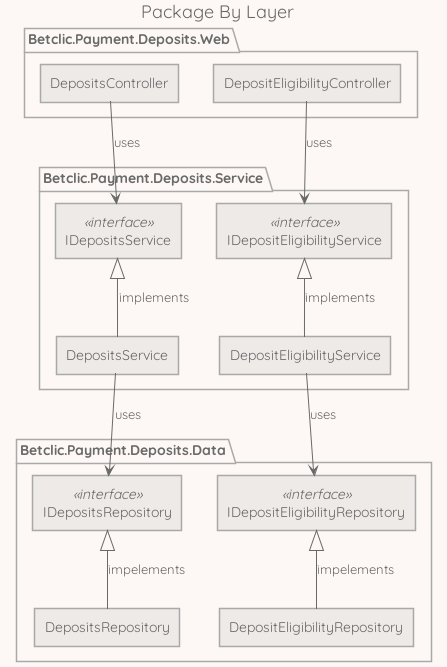
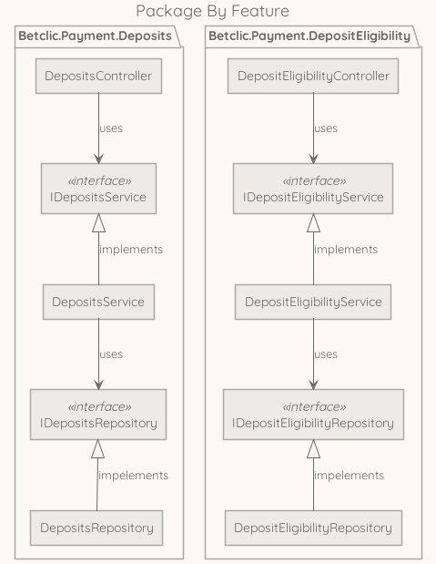
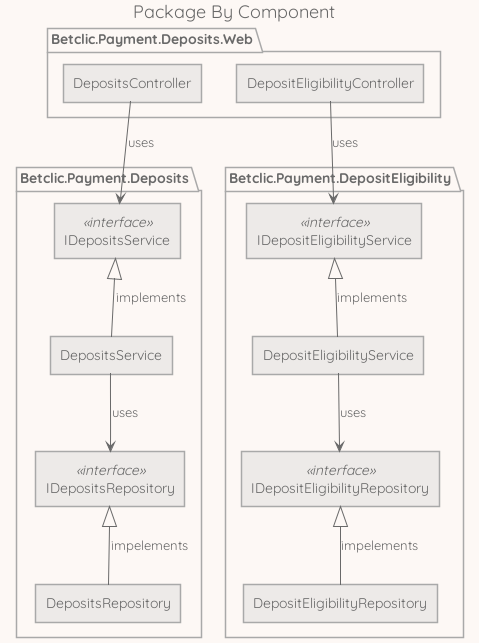

# clean architecture in a nutshell

> Welcome to my presentation of *what is this damned clean architecture in a nutshell*.

First of all, the clean architecture refers to an [article](https://blog.cleancoder.com/uncle-bob/2012/08/13/the-clean-architecture.html) and a [book](https://www.amazon.fr/Clean-Architecture-Craftsmans-Software-Structure/dp/0134494164).
Both are written by **Robert C. Martin** aka **Uncle Bob**.

If you are new to this subject or you want to go further this lecture, please go read them.

Now that we are settled down, let's dive into clean architecture.

So when Uncle Bob released his article in 2012, there were plenty of already existing architecture types. To name a few:

* [Hexagonal Architecture](https://en.wikipedia.org/wiki/Hexagonal_architecture_(software))
* [Onion Architecture](https://jeffreypalermo.com/2008/07/the-onion-architecture-part-1/)
* [Screaming Architecture](https://blog.cleancoder.com/uncle-bob/2011/09/30/Screaming-Architecture.html)

The important thing to understand is that those architectures were already convenient and share the objective, which is the separation of concerns. Here some principles:

* Architecture should be as independent of frameworks as possible
* Business rules should be as testable as possible (no need user interface, database or webserver to test them)
* Business rules should be independent of user interface (business rules do not care if ui is a desktop app, mobile app, or a website)
* Architecture should be independent of the database (the way store and get the data is an implementation detail, not related to business rules)
* Business rules should be independent of outside world (AWS deployment, other micro-services, etc...)

Every architecture mentioned by Uncle Bob in his article tries to achieve those kinds of principles, but uses different ways to layering patterns and different implementations.

The objective of the Clean Architecture from Uncle Bob is to integrate the best of all worlds into a single actionable thing.

## benefits and constraints

> As we have seen before, Clean architecture intent and principles are like damned good promises. But like for everything, those promises comes with great benefits and constraints that need to be taken into account.

### benefits

Let's go for the bright side!

#### built-in separation of concerns

As seen before, by separating concerns you can, for example, focus on your business rules and simply store data into files when a project starts.

Then, when you know more about the way you really need to store those data (relational db, document db, graph, etc...), you just can write code that implements the interface contract.

So, you focus on what matters first (the business rules) and delay technical decision for a moment you can really focus on it.

#### testability

As every concerns is separated and loosely coupled, it becomes really easy to mock.

And when everything is mockable in a blink of an eye, it becomes easy to have a solid base of unit tests (when you are tightly coupled and want to test, you have no other solution than integration tests or e2e tests).

#### screaming use cases

This benefit is especially true for the newcomers in the development team.

In general, an application written in dotnet will mostly follow the same pattern, whatever the business rules, whatever the company. That is the same for Ruby, Python, Java etc...

For example, nothing looks more to a ruby-on-rails code than another ruby-on-rails code.

The Clean Architecture tends to break that kind of patterns.

Clean Architecture enforces file and folder structure to be more business driven.

> So what does the architecture of your application scream? When you look at the top level directory structure, and the source files in the highest level package; do they scream: **Health Care System**, or **Accounting System**, or **Inventory Management System**? Or do they scream: **Rails**, or **Spring/Hibernate**, or **ASP**? (from Screaming Architecture by Robert C. Martin)

#### straightforward dependency rules

As business rules do not depend on technical concerns and thanks to the [pretty simple diagram](https://blog.cleancoder.com/uncle-bob/images/2012-08-13-the-clean-architecture/CleanArchitecture.jpg).

> For example, following the clean architecture diagram, your core domain should not rely on the way you store data, so you should not end up with mixed and matched infrastructure and domain capabilities. So, when you develop you know where you have to put your code and when you have to fix a bug, you know where to start your research.

#### future-proof

Leveraging loosely coupled design and understandable dependency rules, Clean Architecture helps developers to gain productivity over the versions and the business changes.

Also, technical architecture changes are way smoother (moving from RabbitMQ to AWS SQS should not be a painful task).

> You can move from technology to another with confidence because the change impact is very isolated in infrastructure layers or packages.

### constraints

And here comes the dark side...

#### same discipline across the team

There are multiple ways to implement Clean Architecture.
As a matter of facts, the team has to choose his own way and each member has to discipline himself to keep things in good shape.

> Example: No JSON annotation in domain layer.

#### dto & verbosity

As it is recommended to not pass domain model in every layers, it will lead to a lot data mapping similar to Data Transfer Objects (DTOs).

> Passing domain model all the way up in every layers would break **Common Closure Principle** and **Single Responsibility Principle**. For example, an http controller in dotnet knows how to map a domain model into Json response. Domain model should not integrate json annotations or ef annotations.

#### overwhelming structure

Newcomers could feel overwhelmed by the strictness and verbosity and feel lack of freedom.

## packaging examples

### package by layer

### package by feature

### package by component

## different examples of implementation

[nodejs example](https://github.com/jbuget/nodejs-clean-architecture-app)

[dotnet example](https://github.com/bionic-hillbilly/dotnet-simple-clean-arch-rest-api)

[another dotnet example](https://github.com/ardalis/CleanArchitecture)

[java example](https://github.com/jtsato/java-clean-architecture-example)

## make a choice

To conclude, moving to something like Clean Architecture is a pretty tough subject and should be driven in a similar way to:

1. evaluate interest across the team
1. if the team is into it, make sure everyone can learn from the [source](https://www.amazon.fr/Clean-Architecture-Craftsmans-Software-Structure/dp/0134494164) (if not, I strongly suggest we can go drink some beers)
1. when everyone is interested and have read the source book, we can recruit volunteers in order to make a choice of implementation
