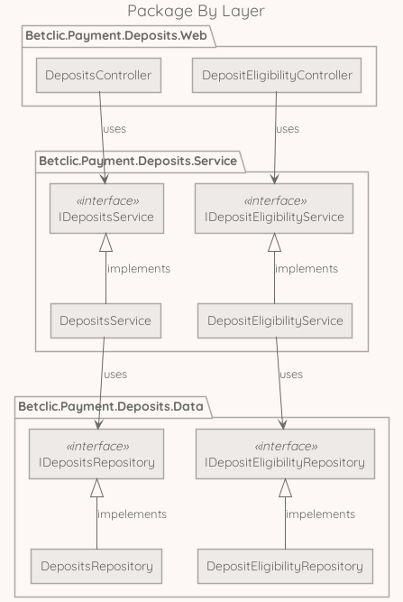
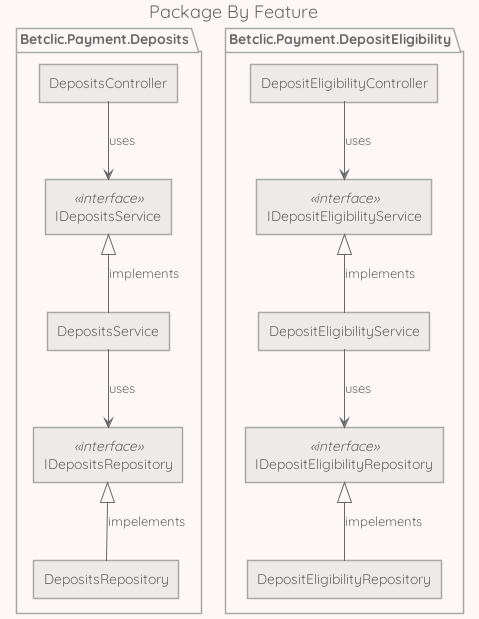
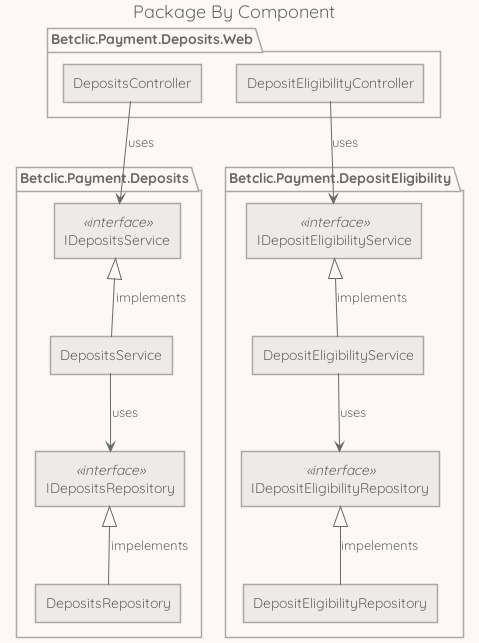

# ⚡ Clean Architecture in a nutshell

https://github.com/bionic-hillbilly/clean-architecture-lecture

---

# 📝 Clean Architecture: where does it come from ?

clean architecture refers to:

* 📝 [an article](https://blog.cleancoder.com/uncle-bob/2012/08/13/the-clean-architecture.html)
* 📖 [a book](https://www.amazon.fr/Clean-Architecture-Craftsmans-Software-Structure/dp/0134494164)

written by **Robert C. Martin** aka **Uncle Bob**

---

# 🧠 The inspiration

* [Hexagonal Architecture](https://en.wikipedia.org/wiki/Hexagonal_architecture_(software))
* [Onion Architecture](https://jeffreypalermo.com/2008/07/the-onion-architecture-part-1/)
* [Screaming Architecture](https://blog.cleancoder.com/uncle-bob/2011/09/30/Screaming-Architecture.html)

---

# 🎯 The objectives

**Separation of concerns**:

* Architecture should be as independent of frameworks as possible
* Business rules should be as testable as possible
* Business rules should be independent of user interface
* Architecture should be independent of the database
* Business rules should be independent of outside world

---

# 🎉 The best of both worlds

---

# ❤️ Benefits

* built-in separation of concerns
* testability
* screaming use cases
* straightforward dependency rules
* future-proof

---

# ⚠️ Constraints

* same discipline across the team
* dto & verbosity
* overwhelming structure

---

# 📦 Package by layer

---

# 📦 Package by feature

---

# 📦 Package by component

---

# 🚀 Make a choice

To conclude, moving to something like Clean Architecture is a pretty tough subject and should be driven in a similar way to:

1. evaluate interest across the team
1. if the team is into it, make sure everyone can learn from the [source](https://www.amazon.fr/Clean-Architecture-Craftsmans-Software-Structure/dp/0134494164) (if not, I strongly suggest we can go drink some beers)
1. when everyone is interested and have read the source book, we can recruit volunteers in order to make a choice of implementation
